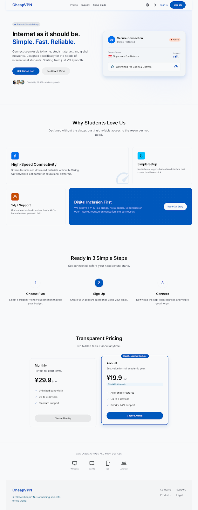
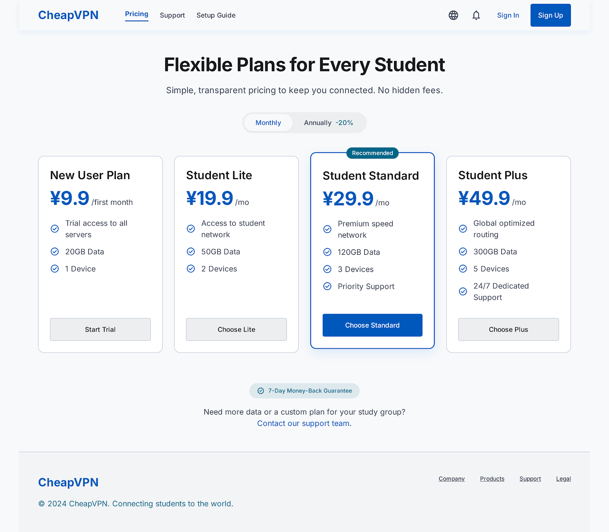
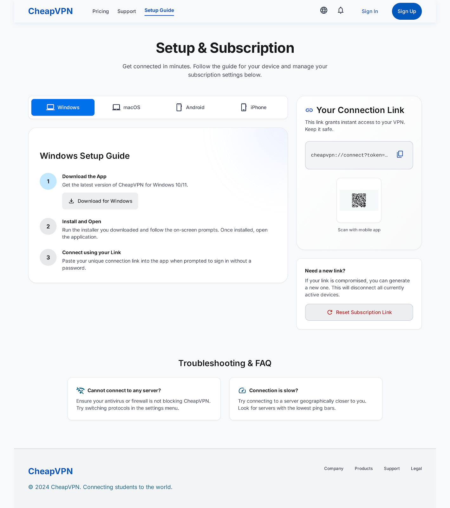
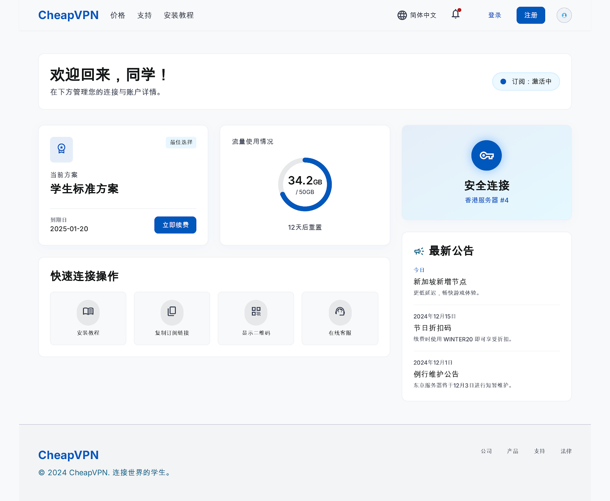
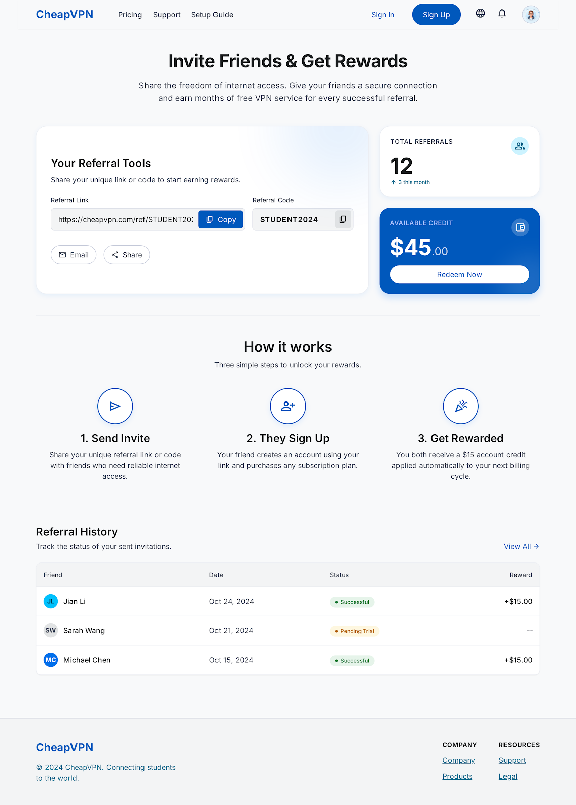
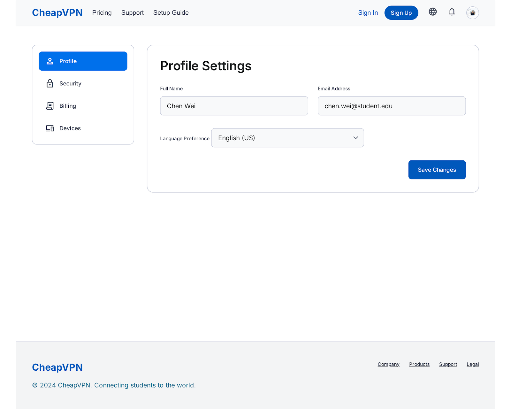

# CheapVPN MVP

CheapVPN is a student subscription console with a Vite client and an Express + SQLite API.

## Recommended production path

Use Node.js + Docker + Caddy as the supported V1.0 deployment: Caddy terminates HTTPS, Express serves the built frontend/API, SQLite persists the service state, and the Provider layer reads from the configured supplier. The Cloudflare Worker is an experimental alternative for compatibility testing; it is not the target for new V1.0 business features.

## Screenshots

| User console | Plans | Setup guide |
| --- | --- | --- |
|  |  |  |

| Dashboard | Referrals | Account settings |
| --- | --- | --- |
|  |  |  |

## Install

```bash
npm install
npm run build
```

The repository includes `package.json` and `package-lock.json`, so dependencies can be installed reproducibly. Do not commit `node_modules`; it is intentionally excluded from Git.

## Download Packages

- [Source package](releases/cheapvpn-student-saas-source.zip): complete source code and deployment configuration.
- [Deployment package](releases/cheapvpn-student-saas-deploy.zip): built frontend, API, migrations, scripts, and Docker files.

Both packages intentionally exclude real `.env` files, local databases, Cloudflare local state, upstream tokens, and `node_modules`.

## Local development

1. Copy `.env.example` to `.env` and set `ADMIN_PASSWORD`, `ADMIN_ENCRYPTION_KEY`, `CORS_ORIGINS`, and the upstream URL or configure a source in `/#admin`.
   Keep `TRUST_PROXY=false` unless a trusted reverse proxy is the component setting `X-Forwarded-Host`; the public subscription links otherwise always use `PUBLIC_BASE_URL`.
2. Run `npm install`.
3. Run `npm run dev:full`.
4. Open `http://127.0.0.1:3000` for the user console and `http://127.0.0.1:3000/#admin` for operations.

Run `npm run test:mvp` for the isolated customer/admin flow, or `npm run test:payment` for the signed payment webhook flow. Both tests use temporary SQLite data and do not modify the local database.
Run `npm run test:all` to execute the complete customer, payment, usage, security, order-concurrency, production-guard, and frontend-proxy regression suite.

The local test suite explicitly enables `ALLOW_PRIVATE_UPSTREAM_URLS=true` only for loopback fixtures. Production must leave it `false`; startup refuses to run when a production process tries to enable it. `GET /api/admin/metrics` is available to authenticated administrators and reports truthful UTC daily/monthly revenue, active subscriptions, expiring subscriptions, payment success rate, upstream sync failures, and open tickets.

With the API and Vite frontend running, `npm run test:smoke` verifies the real frontend proxy at `APP_BASE_URL` (default `http://127.0.0.1:3000`) without creating or modifying a customer.

Run `npm run test:usage` to verify the provider usage API path in isolation: provider response, admin synchronization, and customer-visible usage are checked without touching the local database.

The Vite server proxies `/api` and `/s` to port 4000. The SQLite database is created in `server/data/` and is ignored by Git.

`GET /health` only confirms that the API process is responding. `GET /health/ready` is the production gate: it returns `200` only when an upstream, non-demo payment flow, encryption key, and strong admin password are configured; otherwise it returns `503` with the failed checks.

The subscription page generates the import QR code locally from the CheapVPN subscription URL, so the URL is not sent to an external QR service. Copy buttons remain available for clients that prefer manual import.
The setup page selects a matching format per device: iPhone/iPad uses the universal subscription for Shadowrocket, while Windows, macOS, and Android use the Clash subscription by default. All three formats remain available from the subscription page.

Demo subscription content is disabled by default. Set `ALLOW_DEMO_SUBSCRIPTION=true` only for isolated local demonstrations; production customers must have a configured upstream source before an order can activate.
Demo account access is controlled separately by `ALLOW_DEMO_ACCOUNT`; it is enabled only in the local development `.env` and must remain `false` in production.

Support tickets are stored in SQLite. Customers can submit and review tickets from the Support page; administrators can process them from `/#admin` and set `open`, `in_progress`, `resolved`, or `closed`.

The resource page includes a server-side connection test for each configured source. It checks the universal, Clash, and SingBox addresses without sending upstream content to the browser, and reports only format status and universal node count.
The universal address must return at least one supported node URI (such as VLESS, VMess, Trojan, Shadowsocks, Hysteria, TUIC, or WireGuard); a website, health-check JSON, or empty response is rejected before a customer subscription can be activated.

Node discovery results are cached for five minutes per source version. Editing the source or its naming rules changes the source version and automatically forces a fresh detection.

User and administrator sessions are stored as hashed tokens in SQLite for 30 days, so restarting the API does not immediately sign everyone out. Pending orders can be cancelled by the customer; only one pending order is allowed per customer at a time.

User and administrator logout calls revoke the server-side session immediately; clearing browser storage alone is not relied on for account security.
Administrators can change the control-center password from the top-right `修改密码` action. The new password is stored as a bcrypt hash in SQLite and all other admin sessions are revoked.

Authentication and payment webhook endpoints have a lightweight in-memory rate limit: registration allows 5 requests per IP per 15 minutes, user and administrator login allow 10, and payment callbacks allow 120 per IP per minute. A public multi-instance deployment should additionally put a reverse proxy or shared Redis limiter in front of the API, because this first layer is process-local.

Pending orders expire after 30 minutes. An expired order is released automatically and cannot be confirmed by the user, administrator, or payment callback. A source with active subscriptions cannot be deleted until those subscriptions are reassigned.

In the admin customer list, `重置 Token` immediately invalidates the selected customer's old subscription URL and creates a new one. Use it when a link may have been shared or a customer needs a fresh import link; the customer's plan, expiry, and quota are preserved.

The admin customer endpoint supports `GET /api/admin/users?q=name-or-email&page=1&pageSize=50`; results are paginated (maximum 100 per request) so the operations page remains responsive as the customer count grows.

## Production-style start

Run `npm run build`, then `npm start`. The API server serves the built frontend and API from the same port. Set `PUBLIC_BASE_URL` to that public HTTPS origin before issuing subscriptions.

See [docs/architecture.md](docs/architecture.md), [docs/provider-api.md](docs/provider-api.md), [docs/security.md](docs/security.md), [docs/deployment.md](docs/deployment.md), and [docs/backend-parity.md](docs/backend-parity.md) for the V1.0 boundaries and launch checklist. Historical design exports are under `docs/design-history/`; the two root release archives remain for compatibility and should move to GitHub Releases in a later cleanup.

## Public deployment with Docker

The included `compose.yml` runs the app and Caddy together. Caddy obtains and renews HTTPS certificates automatically, while the app keeps its SQLite database in a Docker volume.

1. Provision an Ubuntu server with Docker Engine and Docker Compose plugin installed.
2. Point the DNS A/AAAA record for your domain to the server and open inbound ports `80` and `443`.
3. Copy `.env.production.example` to `.env.production`, set `DOMAIN`, set `PUBLIC_BASE_URL` to `https://your-domain`, and replace every placeholder secret with a long random value.
4. Configure a real upstream source, a non-mock payment mode, and SMTP settings for password recovery. You can add upstream, payment, and SMTP details later through `/#admin`.
5. Run `docker compose up -d --build`.
6. Confirm `https://your-domain/health/ready` returns `200`, then test registration, purchase, subscription import, expiry, and password recovery from a phone on a mobile network.

Use `docker compose logs -f app` to inspect application logs. Run `docker compose exec app npm run backup` to create a consistent SQLite backup under `./backups/`; schedule that command daily from the server's cron service and copy backups to separate storage. Never expose port `4000` directly in production: only Caddy should be public.

## Cloudflare deployment

The Cloudflare Worker and D1 migrations are deployed separately from the Docker setup. The API token used by Wrangler must be allowed to deploy the Worker, apply D1 migrations, and manage Worker secrets; `wrangler whoami` alone only proves that the token is recognized.

1. Run `npx wrangler whoami` and confirm the account is the one that owns `cheapvpn-prod`.
2. Apply the committed migrations with `npx wrangler d1 migrations apply cheapvpn-prod --remote --config wrangler.jsonc`.
3. Set the encrypted production values with `npx wrangler secret put ADMIN_ENCRYPTION_KEY`, `npx wrangler secret put ADMIN_PASSWORD`, and, for webhook payments, `npx wrangler secret put PAYMENT_WEBHOOK_SECRET`. Use a unique value for each secret; do not put secrets in `wrangler.jsonc` or GitHub.
4. Run `npm run cf:deploy`.
5. Open `https://cheapvpn.hejiujiuvpn.ccwu.cc/health/ready`. A `200` response is required before accepting customers; a `503` response lists the missing production checks.

If a token can run `wrangler whoami` but D1 or secret commands return an authentication error, update the Cloudflare API token permissions before deploying. A dry-run validates the bundle only and does not update the live Worker.

## Payment callback

Use `PAYMENT_MODE=mock` for local testing. For manual or provider-driven operation, set `PAYMENT_MODE=manual` or `PAYMENT_MODE=webhook`; the user cannot call the mock confirmation endpoint in those modes. Set `PAYMENT_WEBHOOK_SECRET` and send a JSON `POST /api/webhooks/payment` with the `x-cheapvpn-signature` HMAC-SHA256 header. The payload must contain `provider`, `eventId`, `orderId`, `status` (`paid`, `succeeded`, `failed`, `cancelled`, or `canceled`), and `amount`. Events are idempotent and the amount must match the order. Failed payment events release the pending order without creating a subscription.
When starting with `NODE_ENV=production`, mock payment is disabled even if `PAYMENT_MODE=mock`; use `manual` or a signed `webhook` flow instead.

For a hosted payment page, set `PAYMENT_CHECKOUT_URL_TEMPLATE` to a URL template such as `https://pay.example.com/checkout?order_id={orderId}&amount={amount}`. The placeholders are URL-encoded, and the checkout URL is returned only with the customer's own order; payment completion still must arrive through the signed webhook or administrator confirmation.
In `PAYMENT_MODE=manual`, set `PAYMENT_MANUAL_INSTRUCTIONS` to the payment account or transfer steps shown on the customer's billing page. The API requires non-empty instructions before it reports the deployment ready or accepts new manual orders. It never marks a manual order paid automatically; an administrator must confirm the received payment.
In `PAYMENT_MODE=webhook`, both `PAYMENT_WEBHOOK_SECRET` and `PAYMENT_CHECKOUT_URL_TEMPLATE` are required; otherwise order creation is rejected instead of leaving customers with an unpayable pending order. Webhook event IDs are idempotent and cannot be reused for another order.
The administrator can also update the payment mode, checkout template, manual instructions, and webhook secret from `/#admin` under Orders. These values are stored in the encrypted settings table and override the environment defaults; the webhook secret is never returned to the browser.

Before public launch, replace the local `ADMIN_PASSWORD=123` with a long unique password, set a random `ADMIN_ENCRYPTION_KEY` and `PAYMENT_WEBHOOK_SECRET`, and use HTTPS for `PUBLIC_BASE_URL`.
Set `CORS_ORIGINS` to the exact HTTPS browser origin(s) used by the customer console, separated by commas. In production, unlisted browser origins do not receive CORS permission; native VPN clients do not need this setting.

To rotate the admin password and encryption key without breaking stored upstream URLs or payment/usage credentials, stop the API and run `$env:NEW_ADMIN_PASSWORD='a-long-password'; $env:NEW_ADMIN_ENCRYPTION_KEY='a-32-character-or-longer-random-key'; npm run rotate:secrets`, then start the API again. The tool backs up `.env`, re-encrypts all source URLs and encrypted settings, and revokes existing admin sessions.

## LAN phone testing

Use the computer's LAN address, not `127.0.0.1`, and allow inbound TCP 3000 in Windows Firewall. Keep the phone and computer on the same network. For production, use HTTPS and a domain instead of exposing the development server.

## Usage limitation

The app can store manual customer usage and parse an upstream `subscription-userinfo` header as aggregate upstream usage. A shared upstream token cannot provide accurate per-customer traffic accounting; that requires a supplier API or an individual upstream account per customer.

When a supplier can export per-customer usage, an administrator can import it from `/#admin` on the Users & Usage page. The JSON shape is `[{"email":"student@example.com","usedGb":12.5}]`; the server validates the user, active subscription, and plan quota, then records the source as `provider-import`. The same operation is available as `POST /api/admin/usage/import` with the admin bearer token.

For automatic usage sync, configure `UPSTREAM_USAGE_API_URL` and optionally `UPSTREAM_USAGE_API_TOKEN`. The API may return either an array or `{"records":[...]}`; each record accepts `email` (or `userEmail`) and `usedGb` (also `used_gb` or `used`), with optional `totalGb` and `expiresAt` fields. Trigger `POST /api/admin/usage/sync` from the admin page or an authorized scheduler. The provider token stays server-side; an imported upstream expiry is also checked by the automatic subscription expiry job.
Every activation, provider sync, import, and manual adjustment records a usage snapshot. Administrators can query `GET /api/admin/users/:id/usage/history` or use the `历史` action in the Users & Usage page.
New customers normally use the marked default source. Set `UPSTREAM_ASSIGNMENT_MODE=round_robin` to distribute new customers across all enabled sources by a stable customer-id assignment; renewals remain on their existing source.

To let the API synchronize automatically, set `UPSTREAM_USAGE_SYNC_INTERVAL_MS=300000` (minimum 30 seconds). The scheduled job is disabled when no usage API URL is configured and skips overlapping runs.
